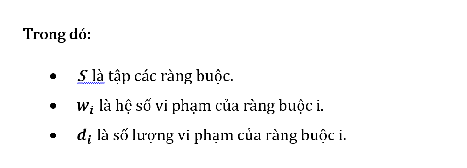

<div align="center">

# Thuật toán lập thời khóa biểu

</div>

---
- [Giới thiệu](#giới-thiệu)
- [Cấu trúc tập tin](#cấu-trúc-tập-tin)
- [Tiêu chí đánh giá chất lượng](#tiêu-chí-đánh-giá-chất-lượng)
- [Giải thuật](#giải-thuật)
- [Thực nghiệm](#thực-nghiệm)
- [Screenshots](#screenshots)
---

## Giới thiệu
Thuật toán giúp tự động sắp xếp thời khóa biểu THPT cho học sinh và giáo viên. Chất lượng của thời khóa biểu được đánh giá dựa trên nhiều ràng buộc cứng và mềm dựa trên dữ liệu thực tế. *Đây là thuật toán được cài đặt hỗ trợ cho bài báo khoa học của học viên cao học Nguyễn Hồ Thiên Đăng và TS. Phan Tấn Quốc.*

## Cấu trúc tập tin

**Chương trình chính**: ```main.cpp```

**Input Files**:

(Dữ liệu mẫu - *Trường THPT Ngô Quyền, Q.7, TP.HCM*)

```PC_HK1.txt```
```PC_HK2.txt```
(Danh sách phân công của học kì I và II).

```
cấu trúc file: <Mã PC> <Lớp> <Môn> <Mã GV> <Số Tiết> <Cụm>
vd: PC001 10A Anh GV1024 3 2
```

**Output Files**:
- TKB của lớp: ```TKB_lop.txt```
- TKB của gv: ```TKB_gv.txt```
- Vi phạm của lớp: ```VP_lop.txt```
- Vi phạm của gv: ```VP_gv.txt```
- Vi phạm chi tiết: ```VP_chitiet.txt```
- Vi phạm tổng: ```VP_tong.txt```
- Số liệu về điểm vi pham (Cải Thiện 2): ```stat.txt```

## Tiêu chí đánh giá chất lượng
Chất lượng của một thời khóa biểu thể hiện qua thời khóa biểu của các lớp học và thời khóa biểu của mỗi giáo viên. Việc đánh giá chất lượng một thời khóa biểu là công việc khó khăn và thông thường giáo viên sẽ đánh giá dựa vào thông tin thời khóa biểu có vi phạm các ràng buộc của bài toán

### Danh sách các điều kiện ràng buộc
Chi tiết: [Chi tiết ràng buộc](./Docs/11%2004%202020_Danh%20sach%20cac%20rang%20buoc%20cua%20bai%20toan%20xep%20TKB%20(cap%20nhat%208%204%202020).pdf)

*Trọng số các vi phạm ràng buộc cứng và ràng buộc mềm*
| STT | Tên ràng buộc                                                        | Trọng số |
|-----|----------------------------------------------------------------------|----------|
| 1   | H1: Ràng buộc đụng độ giáo viên                                      | 999      |
| 2   | H2: Ràng buộc đụng độ lớp học                                        | 999      |
| 3   | H3: Ràng buộc đụng độ phòng học                                      | 999      |
| 4   | H4: Ràng buộc về môn học chỉ học 1 lần trong một buổi                | 600      |
| 5   | H5: Ràng buộc tiết lủng của lớp theo buổi                            | 600      |
| 6   | H6: Ràng buộc về tiết không xếp của giáo viên                        | 600      |
| 7   | H7: Ràng buộc về môn học có giới hạn số giáo viên cùng dạy đồng thời | 600      |
| 8   | S1: Ràng buộc về lịch bận của các giáo viên                          | 20       |
| 9   | S2: Ràng buộc về học cách ngày các môn học trong một lớp             | 20       |
| 10  | S3: Ràng buộc về độ nén lịch dạy của giáo viên                       | 10       |
| 11  | S4: Ràng buộc về tiết lủng của giáo viên theo buổi học               | 5        |
| 12  | S5: Ràng buộc về số buổi chỉ dạy 1 tiết trong tuần của giáo viên     | 10       |
| 13  | S6: Ràng buộc về số tiết tối thiểu trong một vuổi học của một lớp    | 20       |
| 14  | S7: Ràng buộc về số môn học tối đa trong mỗi buổi học                | 10       |

### Công thức điểm vi phạm (càng nhỏ càng tốt)

Điểm vi phạm dựa vào hệ số vi phạm và số lần vi phạm của từng ràng buộc.




## Giải thuật

+ **Tiền xử lý**: Khởi tạo trạng thái bắt đầu cho TKB lớp và giáo viên theo các tiêu chí ưu tiên.
+ **Cải Thiện 1**: Làm gọn TKB và Thêm PC chưa xếp (không quan tâm đến điểm vi phạm, có thể làm tăng hoặc giảm điểm vi phạm)
+ **Cải Thiện 2**: Làm giảm điểm vi phạm
+ (Optional): Khi chạy Cải Thiện 1 và Cải Thiện 2 xong mà vẫn còn phân công chưa xếp thì lặp lại Cải Thiện 1 và Cải Thiện 2.

## Thực nghiệm

### Bộ dữ liệu mẫu

Với dữ liệu mẫu (dữ liệu thực tế được lấy từ *Trường THPT Ngô Quyền, Q.7, TP.HCM, 2019 - 2020*)

```PC_HK1.txt```: Thời khóa biểu học kì I của 3 khối lớp 10, 11, 12.

```PC_HK2.txt```: Thời khóa biểu học kì II của 3 khối lớp 10, 11, 12. 

*Bảng thông số các bộ dữ liệu thực nghiệm*
| STT | Loại dữ liệu                     | PC_HK1.txt | PC_HK2.txt |
|-----|----------------------------------|------------|------------|
| 1   | Số giáo viên có phân công        | 76         | 73         |
| 2   | Số phòng học                     | 36         | 36         |
| 3   | Số môn học                       | 45         | 44         |
| 4   | Số phân công                     | 485        | 475        |
| 5   | Số ràng buộc cứng                | 11         | 11         |
| 6   | Số ràng buộc mềm                 | 8          | 8          |
| 7   | Số buổi học trong tuần           | 6          | 6          |
| 8   | Số tiết tối đa trên mỗi buổi học | 5          | 5          |

### Kết quả

So sánh kết quả chạy của giải thuật với kết quả mẫu ([Thời khóa biểu thật của trường](./Docs/TKB.xlsx))

| STT | Học kì    | Điểm vi phạm |
|-----|-----------|--------------|
| 1   | Học kì I  | 2245         |
| 2   | Học kì II | 2070         |

Thực nghiệm chạy 10 lần với mỗi học kì.

Bảng thực nghiệm Học kì I.
| STT | Điểm vi phạm | Thời gian chạy (ms) |
|-----|--------------|---------------------|
| 1   | 2345         | 245938              |
| 2   | 2430         | 220383              |
| 3   | 2130         | 260483              |
| 4   | 2965         | 119384              |
| 5   | 1845         | 350421              |
| 6   | 1990         | 429312              |
| 7   | 1765         | 324936              |
| 8   | 2105         | 245294              |
| 9   | 2040         | 295603              |
| 10  | 2085         | 390249              |

Bảng thực nghiệm Học kì II
| STT | Điểm vi phạm | Thời gian chạy (ms) |
|-----|--------------|---------------------|
| 1   | 2580         | 273829              |
| 2   | 2470         | 283921              |
| 3   | 2130         | 395482              |
| 4   | 2290         | 189434              |
| 5   | 2130         | 195733              |
| 6   | 2400         | 184092              |
| 7   | 2795         | 284591              |
| 8   | 2950         | 274921              |
| 9   | 3245         | 395018              |
| 10  | 2230         | 293494              |

Bảng kết quả thực nghiệm
| STT | Học kì    | Điểm vi phạm |
|-----|-----------|--------------|
| 1   | Học kì I  | 2130         |
| 2   | Học kì II | 1765         |

## Screenshots


<div align="left">

### Danh sách phân công

---
</div>
  
<br><br><br><br><br><br><br><br><br><br><br><br><br>
  


<div align="left">

### Thời khóa biểu của lớp

---

</div>

<br><br><br><br><br><br><br><br><br><br><br><br><br>
  


<div align="left">

### Thời khóa biểu của giáo viên

---

</div>

<br><br><br><br><br><br><br><br><br><br><br><br><br>
  


<div align="left">

### Biểu đồ về điểm vi phạm theo thời gian

---

</div>
